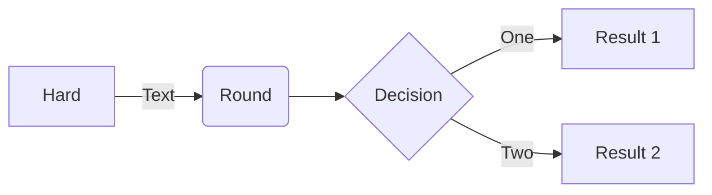

# My Project

Migrate knowledge base loader, explorer, interface to one app and repository


## Claude Project
https://claude.ai/chat/6f0a3125-20fe-42e5-8723-b00d313f4f33

# To run the main program, first start the virtual environment, then execute the app module
## Create and install dependencies, if necessary
```sh
pyenv activate project-env
```
```sh
python project/app.py
```
## Run in debug mode
```sh
python project/app.py -d
```
## To get help
```sh
python project/app.py -h
```

## Project Layout
knowledge_base/
│
├── README.md                  # Project documentation
├── pyproject.toml            # Project metadata and dependencies
├── requirements.txt          # Direct dependencies
├── requirements-dev.txt      # Development dependencies
├── Makefile                  # Common commands and utilities
├── .env.example             # Example environment variables
│
├── src/
│   ├── knowledge_base/
│   │   ├── __init__.py
│   │   │
│   │   ├── ui/              # Frontend PyQt6 components
│   │   │   ├── __init__.py
│   │   │   ├── main_window.py
│   │   │   ├── content_browser.py
│   │   │   ├── search.py
│   │   │   ├── visualizations.py
│   │   │   ├── settings.py
│   │   │   └── widgets/     # Reusable UI components
│   │   │
│   │   ├── core/            # Core application logic
│   │   │   ├── __init__.py
│   │   │   ├── content_manager.py
│   │   │   ├── discovery.py
│   │   │   └── analytics.py
│   │   │
│   │   ├── extractors/      # Content source extractors
│   │   │   ├── __init__.py
│   │   │   ├── base.py
│   │   │   ├── arxiv.py
│   │   │   ├── github.py
│   │   │   ├── youtube.py
│   │   │   └── web.py
│   │   │
│   │   ├── processors/      # Content processing
│   │   │   ├── __init__.py
│   │   │   ├── text.py
│   │   │   ├── metadata.py
│   │   │   └── pipeline.py
│   │   │
│   │   ├── ai/             # AI/ML components
│   │   │   ├── __init__.py
│   │   │   ├── llm_manager.py
│   │   │   ├── embedding_manager.py
│   │   │   ├── local_models.py
│   │   │   └── remote_models.py
│   │   │
│   │   ├── storage/        # Data persistence
│   │   │   ├── __init__.py
│   │   │   ├── database.py
│   │   │   ├── cache.py
│   │   │   └── files.py
│   │   │
│   │   ├── utils/          # Shared utilities
│   │   │   ├── __init__.py
│   │   │   ├── config.py
│   │   │   ├── logger.py
│   │   │   └── validators.py
│   │   │
│   │   └── visualization/  # Visualization components
│   │       ├── __init__.py
│   │       ├── knowledge_graph.py
│   │       ├── timeline.py
│   │       └── topic_clusters.py
│   │
│   └── main.py            # Application entry point
│
├── tests/                 # Test suite
│   ├── __init__.py
│   ├── conftest.py
│   ├── test_extractors/
│   ├── test_processors/
│   ├── test_ai/
│   └── test_storage/
│
├── scripts/              # Utility scripts
│   ├── setup_db.py
│   ├── migrate_data.py
│   └── backup.py
│
├── docs/                 # Documentation
│   ├── installation.md
│   ├── usage.md
│   ├── architecture.md
│   └── api/
│
└── data/                # Data directory
    ├── cache/           # Cache storage
    ├── files/           # File storage
    └── models/          # Local model storage


## Reference
https://docs.python-guide.org/writing/structure/

## ToDo
* A thing

### _sample mermaid chart_

