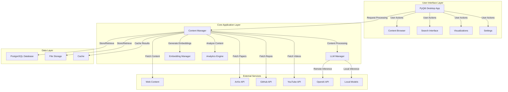
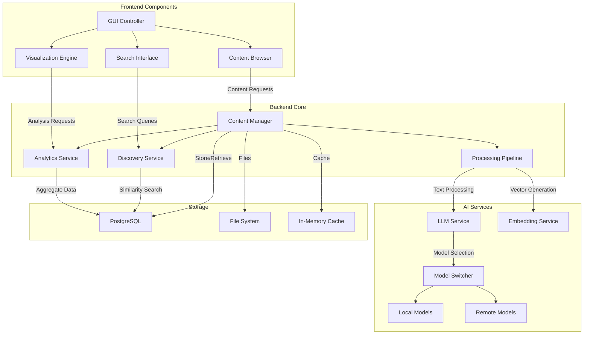

# Project Design Doc

## Goal
### Secondary Goal

## User Story

## Requirements

## Workflow

## Provide abstractions for

## System Component Design

```mermaid
graph TB
    subgraph UI["User Interface Layer"]
        GUI["PyQt6 Desktop App"]
        GUI --> |"User Actions"| ContentBrowser["Content Browser"]
        GUI --> |"User Actions"| Search["Search Interface"]
        GUI --> |"User Actions"| Viz["Visualizations"]
        GUI --> |"User Actions"| Settings["Settings"]
    end

    subgraph Core["Core Application Layer"]
        CM["Content Manager"]
        LLM["LLM Manager"]
        EM["Embedding Manager"]
        AN["Analytics Engine"]
        
        CM --> |"Content Processing"| LLM
        CM --> |"Generate Embeddings"| EM
        CM --> |"Analyze Content"| AN
    end

    subgraph Data["Data Layer"]
        DB["PostgreSQL Database"]
        Files["File Storage"]
        Cache["Cache"]
    end

    subgraph External["External Services"]
        Web["Web Content"]
        ArXiv["ArXiv API"]
        GitHub["GitHub API"]
        YouTube["YouTube API"]
        OpenAI["OpenAI API"]
        Local["Local Models"]
    end

    GUI --> |"Request Processing"| CM
    CM --> |"Store/Retrieve"| DB
    CM --> |"Store/Retrieve"| Files
    CM --> |"Cache Results"| Cache
    
    CM --> |"Fetch Content"| Web
    CM --> |"Fetch Papers"| ArXiv
    CM --> |"Fetch Repos"| GitHub
    CM --> |"Fetch Videos"| YouTube
    
    LLM --> |"Remote Inference"| OpenAI
    LLM --> |"Local Inference"| Local
```

## System Interaction Design

```mermaid
flowchart TB
    subgraph FE[Frontend Components]
        direction TB
        GUI[GUI Controller]
        CB[Content Browser]
        SI[Search Interface] 
        VE[Visualization Engine]
        
        GUI --> CB
        GUI --> SI
        GUI --> VE
    end

    subgraph BE[Backend Core]
        direction TB
        CM[Content Manager]
        PP[Processing Pipeline]
        DS[Discovery Service]
        AS[Analytics Service]
        
        CM --> PP
        CM --> DS
        CM --> AS
    end

    subgraph AI[AI Services]
        direction TB
        LLM[LLM Service]
        EM[Embedding Service]
        
        LLM --> |Model Selection| MS[Model Switcher]
        MS --> LM[Local Models]
        MS --> RM[Remote Models]
    end

    subgraph ST[Storage]
        direction TB
        PG[PostgreSQL]
        FS[File System]
        IC[In-Memory Cache]
    end

    %% Cross-component interactions
    CB --> |Content Requests| CM
    SI --> |Search Queries| DS
    VE --> |Analysis Requests| AS
    
    PP --> |Text Processing| LLM
    PP --> |Vector Generation| EM
    
    CM --> |Store/Retrieve| PG
    CM --> |Cache| IC
    CM --> |Files| FS
    
    DS --> |Similarity Search| PG
    AS --> |Aggregate Data| PG
```
